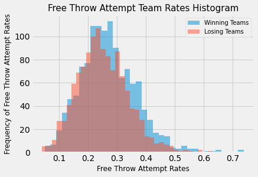

# Basketball on Paper

### Background

Introduced to the sport and game of basketball at a young age, my curiosity follows in determining how integral offensive rebounding by itself is to game wins. As included in Dean Oliver's four factors, rebounding is a factor that in combination with the other factors is presumed by many to correlate closely with winning games. In recent seasons leading up to the 2018-19 season, we see a declining trend in seeking out the offensive rebound. "Years ago, every coach was looking for offensive rebounds," says Luis Scola, Toronto's starting power forward. "And now it's so different, because coaches don't want to give up transition points. That's why players stopped doing it." In the exploration of this question, we explore various NBA statistics and in particular look at offensive rebounding percentages.

### Question and Hypotheses

Question: Is offensive rebounding statistically significant for game wins?

Null hypothesis: There is no statistically meaningful difference of the offensive rebounding % on achieving game wins.

Alternative hypothesis: There is a statistically meaningful difference of the offensive rebounding % on achieving game wins.

### Data

Data consisted of NBA 2018-19 regular season game statistics from NBA.com APIs via the client package at [nba-api](https://pypi.org/project/nba-api/). Data drawn is comprised of a game log, league stats, and various play stats by team. From the season data, I select the four factors to explore performance between winning and losing teams:

1. Effective field goal percentage (EFG%) - shooting the ball
1. Turnover rate (TO rate) – failure to take care of the ball
1. Rebounding percentage (REB%) - ball recovery by a team 
1. Free throw attempt rate (FTA rate) - getting to the foul line

EFG%             |  TO%
:-------------------------:|:-------------------------:
        |  

REB%             |  FTA rate
:-------------------------:|:-------------------------:
        |  

### Methods

The statistical test applied is a Welch’s t-test on the difference of means between the winning and losing team samples (without knowing the standard deviations of the winning and losing team populations, the student’s t-test is not well suited here). Because the sample sizes are sufficiently large, we can additionally consider that the central limit theorem applies and therefore we can reasonably assert that the distribution for the difference of means approximates the normal distribution.

### Results

The null hypothesis is rejected - there is statistical evidence to infer that strong offensive rebounding is characteristic of game winning teams.

With a significance level selected at 1%, the p-value resulting from the Welch’s t-test falls below the significance threshold.

OREB%             
:-------------------------:|
       
p-value: 1.1728088676657435e-13 

### Future Analysis

- OREB% comparison by teams (and their varying play or strategy)
- OREB% comparison by other seasons
- OREB% relation to fast break points 

### Acknowledgements

Thanks to Juliana Duncan, Dan Rupp & Kiara Hearn for their help and guidance during this project.

### References
API client package: [nba-api](https://pypi.org/project/nba-api/)
