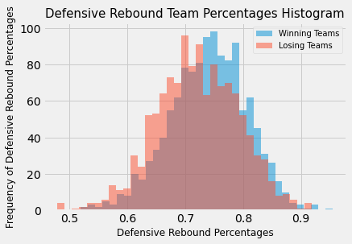

# Basketball on Paper

### Background

Introduced to the sport and game of basketball at a young age, my curiosity follows in determining whether offensive or defensive play is equivalently integral to game wins. In the exploration of this question, we look through the prism of some of the NBA's advanced statistics.  

### Question and Hypotheses

Question: Is offensive or defensive game play more integral to wins?

Null hypothesis: There is no difference between offensive and defensive game play stats for wins.

Alternative hypothesis: There is a difference between offensive and defensive game play stats for wins.

### Data

Data consisted of NBA 2018-19 regular season game statistics from NBA.com APIs via the client package at [nba-api](https://pypi.org/project/nba-api/). Data drawn is comprised of a game log, league stats, and play stats by team. From the season data, I select the following statistics to compare winning and losing teams as proxies to measure offensive and defensive play:

Offensive play statistics:
1. Effective field goal percentage (EFG%) - shooting the ball
1. Offensive rebounding percentage (OREB%) - ball recovery by the offensive team
1. Free throw attempt rate (FTA rate) - getting to the foul line

Defensive play statistics:
1. Turnover rate (TO rate) – failure to take care of the ball
1. Defensive rebounding percentage (DREB%) - ball recovery by the defensive team
1. Block attempt rate (BLKA rate) - guarding the rim

The EFG%, REB%, TO rate, and the FTA rate are commonly known as the four factors, which are box score derived metrics and are presumed by many to correlate closely with winning games. With a focus on drawing comparisons in offensive and defensive play, I add a measure for a BLKA rate.

### Methods

The statistical test applied is a Welch’s t-test on the difference of means between the winning and losing team samples (without knowing the standard deviations of the winning and losing team populations, the student’s t-test is not well suited here). Because the sample sizes are sufficiently large, we can additionally consider that the central limit theorem applies and therefore we can reasonably assert that the distribution for the difference of means approximates the normal distribution.

### Results

For each of the play statistics by NBA team below, the null hypothesis is rejected - there is statistical evidence to infer that there is a difference between offensive and defensive game play stats for wins.

With a significance level selected at 5% and a conservative Bonferroni correction application which further sets the significance level at 1.25% for each t-test, the Welch’s t-tests results of infinitesimally small p-values provide suitable statistical evidence. 

p-value: 3.029870529831025e-129

p-value: 3.04422770092005e-12

p-value: 1.4689448438961602e-07

p-value: 7.22946836638982e-07

p-value: 2.969990853938123e-1

### Acknowledgements

Thanks to Juliana Duncan, Dan Rupp & Kiara Hearn for their help and guidance during this project.

### References
API client package: [nba-api](https://pypi.org/project/nba-api/)
